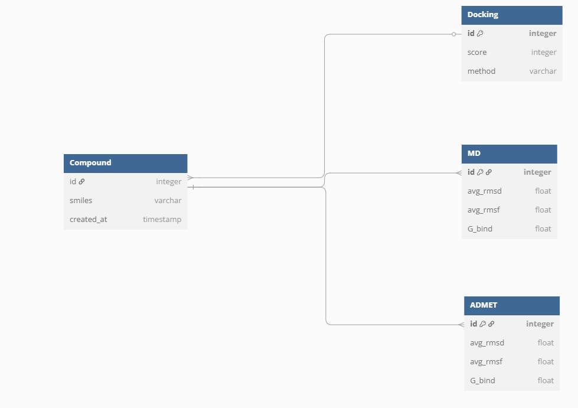

# PMDB (PARPi Modifications DataBase)

## A web application for storing and analyzing chemical compound data, including:  

* Basic properties (name, SMILES)
* Docking results
* ADMET profiles
* Results of Molecular Dynamics (MD)
* Visualization of a molecule by SMILES in 2D (via RDKit)


## Features

* Adding/Editing/deleting connections
* Search and sorting by interaction energy (ΔG)
* View full connection information
* Displaying the connection structure based on SMILES


## Installation and launch
1. **Clone the repository**

```
git clone git@github.com:AlexeyChutko/SPBU_hw_db.git
cd SPBU_hw_db
```
2. **Create and activate a virtual environment**  
With venv
```
python3 -m venv venv
source venv/bin/activate  # Windows: venv\Scripts\activate
```
With conda
```
conda create -n pmdb python=3.11
conda activate pmdb
```
3. **Install the dependencies**
```
pip install -r requirements.txt
```
4. **Run the app**
```
python app.py
```

## The database structure
